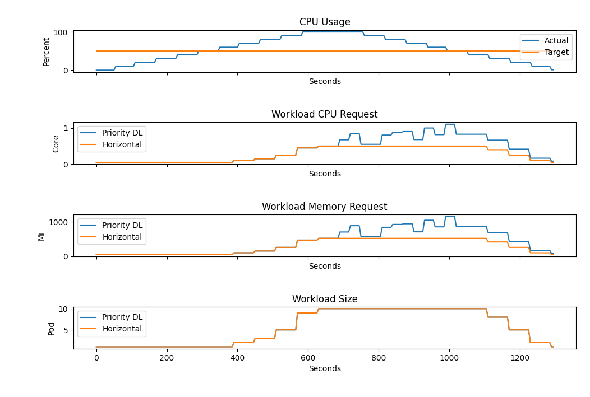

# Testing

## Introduction
The project includes a Python automated test suite to provide

- automated
- reproducible
- comparable

test results in order to efficiently observe and compare different elasticity strategy behavior. As this project is meant to implement an Average CPU SLO with mutliple elasticity strategies combined, this test suite leverages the *demo-metric-controller* to inject predefined values that are picked up by Prometheus.

## Key Aspects

This approach promotes flexibility in terms of testing any predefined values as well as historical metrics from any live system. Currently, there are four key metrics that are used for comparing elasticity strategies:

- actual and target CPU utilization
- total requested CPU of workload
- total requested memory of workload
- total number of pods of workload

## Example

In this example you can see that results of two elasticity strategies: priority decision logic that combines horizontal scaling with vertical scaling and simple horizontal scaling.

## Adding Test Cases

You can implement your own test cases by reusing the test.py module and setting up the necessary stubs (or even real workloads) as well as SLO mappings.
