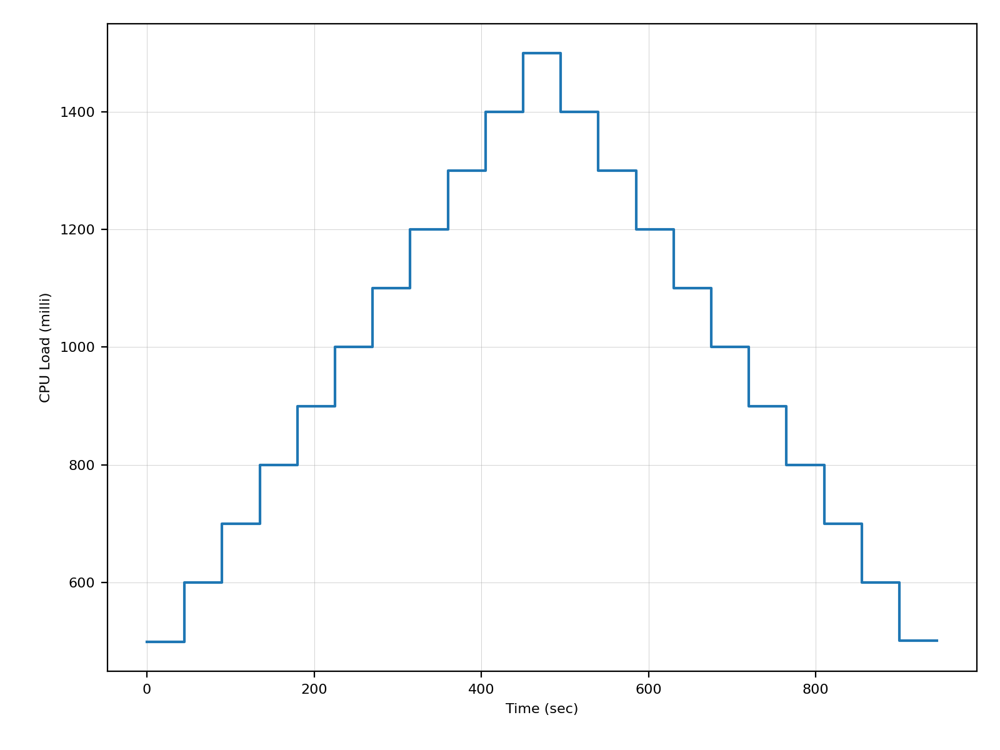
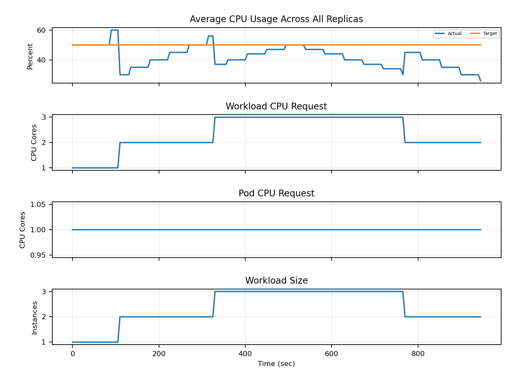
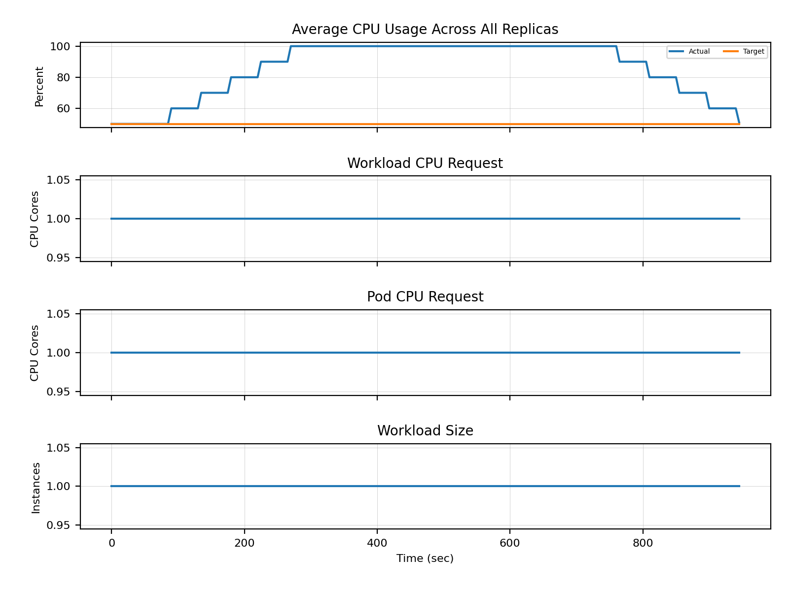
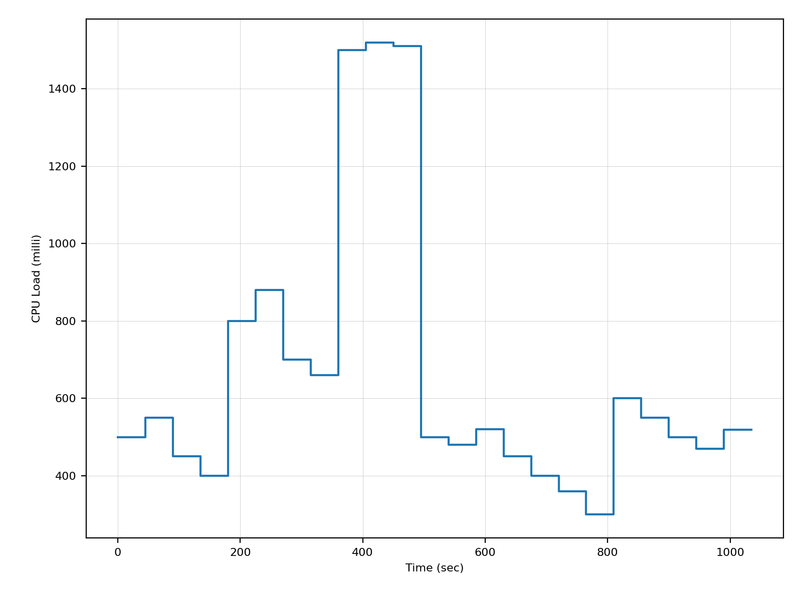
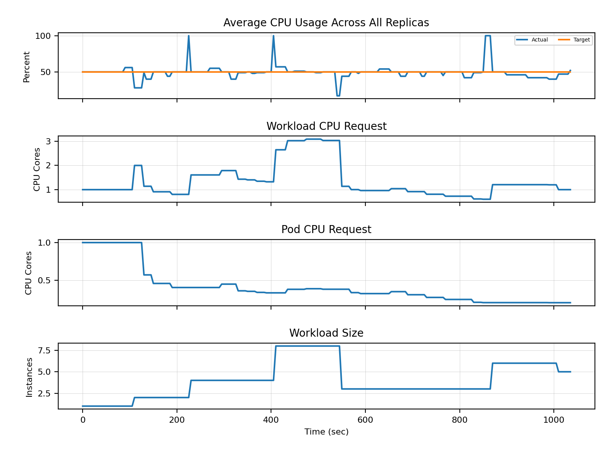
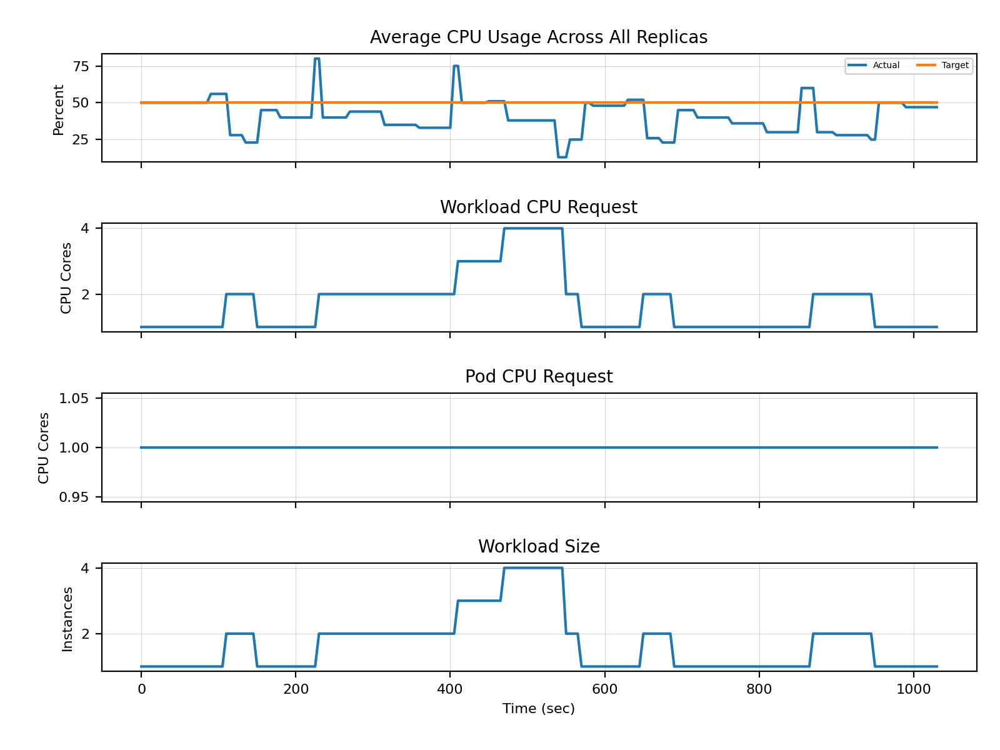
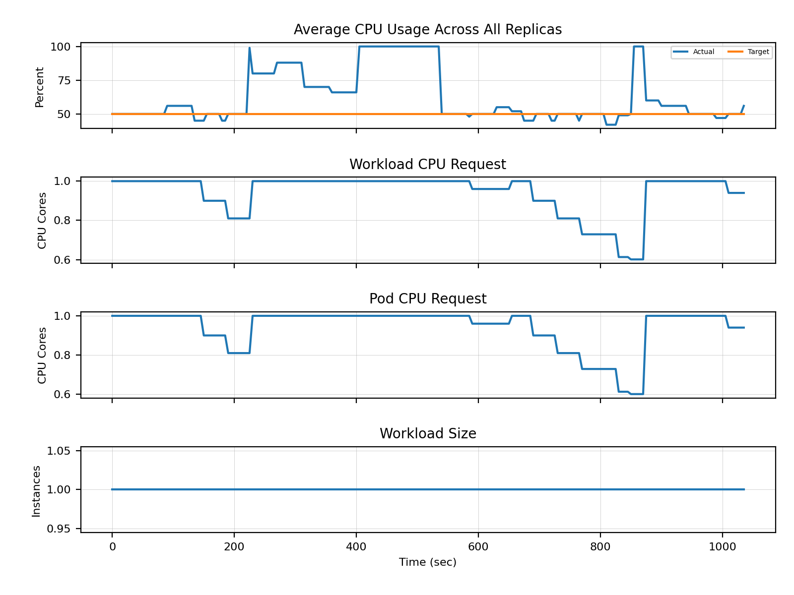

# Testing Using Fake CPU Load

This testing approach aims to show the effects of combinations of different elasticity strategies with custom decision logics.
As reproducibility is an important factor, the test environment uses multiple controlled artificial metrics to provide a comparable base for different setups.

First, a predefined list of CPU Load values defined in millis injected into the demo-cpu-load-metric-controller. The values are iterated over using them 45 seconds each.
This metric is picked up by the demo-average-cpu-utilization-metric-controller which divides it by the target workload CPU.

    Workload CPU Allocation
      min(
        kube_pod_container_resource_limits{pod=~"resource-consumer.*"}
      ) * 
      min(
        kube_deployment_spec_replicas{deployment="resource-consumer"}
      )

    CPU Load
      polaris_composed_metrics_polaris_slo_cloud_github_io_v1_cpu_load

    CPU Usage Percent
      CPU Load / Workload CPU Allocation * 100
      = polaris_composed_metrics_polaris_slo_cloud_github_io_v1_average_cpu_utilization

## Configuration and Environment

The tests presented in this document are executed using minikube with the following configuration:

    minikube start --kubernetes-version=v1.27.3
    minikube addons enable metrics-server
    minikube addons enable ingress

All base tests are carried out with the same `staticElasticityStrategyConfig`

    ...
    staticElasticityStrategyConfig:
      maxResources:
        milliCpu: 1000
        memoryMiB: 100
      minResources:
        milliCpu: 200
        memoryMiB: 50
      minReplicas: 1
      maxReplicas: 10

# CPU Load Scaling Analysis

## Linear CPU Load Changes

|                     **CPU Load**                     |              **Best-fit Strategy**               | 
|:----------------------------------------------------:|:------------------------------------------------:|
|       |    |
|                **Horizontal Scaling**                |               **Vertical Scaling**               |
|  |  |

## Sudden CPU Load Changes

|                       **CPU Load**                        |                 **Best-fit Strategy**                 | 
|:---------------------------------------------------------:|:-----------------------------------------------------:|
|       |    |
|                  **Horizontal Scaling**                   |                 **Vertical Scaling**                  |
|  |  |
