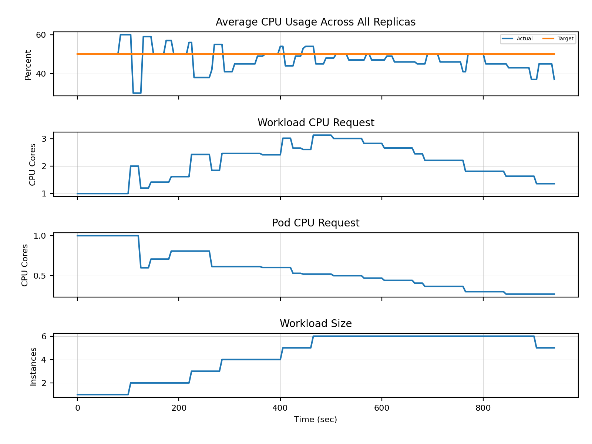
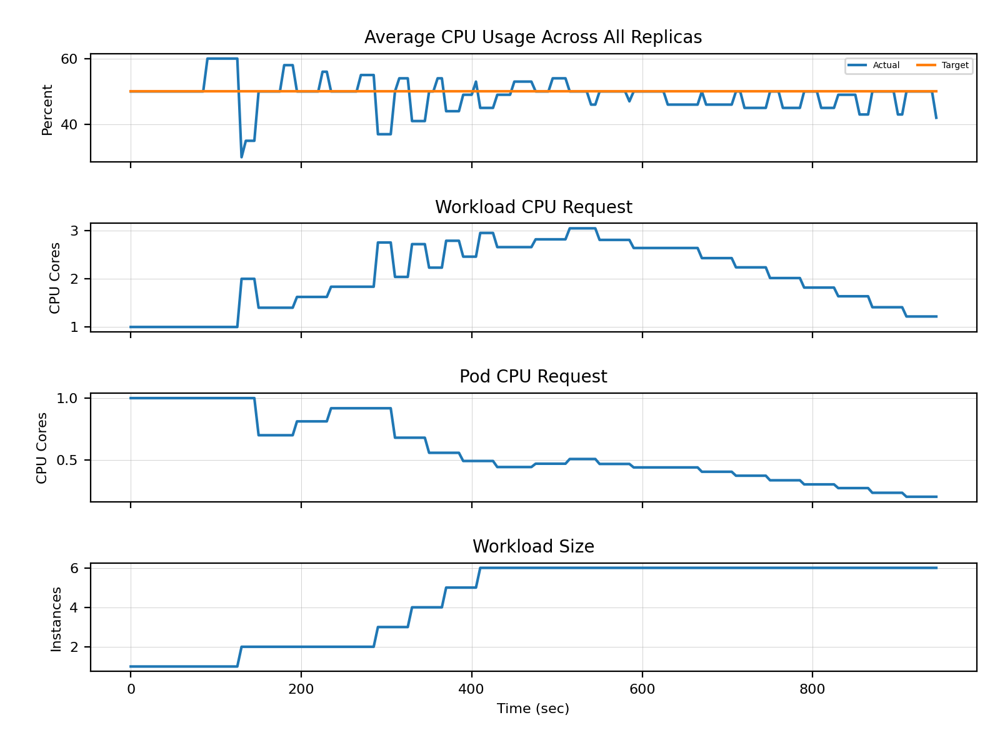

# Load Testing

This testing approach aims to show the effects of combinations of different elasticity strategies with custom decision logics.
We use Kubernetes' [Resource Consumer](https://pkg.go.dev/k8s.io/kubernetes/test/images/resource-consumer) to generate CPU load on the target workload.
The resource consumer is triggered by an HTTP request for a short duration to generate a predefined amount of CPU millis.
In order to distribute this load over multiple instances of the target deployment, we send the HTTP requests 10 times per second.

The resulting charts should show that an elasticity strategies are used to establish compliance with the SLO.
Individual test results can be then compared by the reader.
Even though reproducibility is an important factor for testing, this approach does not allow testcases to be fully reproduced due to various reasons like I/O errors.

## Configuration and Environment

The tests presented in this document are executed using minikube with the following configuration:

    minikube start --kubernetes-version=v1.27.3 --feature-gates=InPlacePodVerticalScaling=true --container-runtime=containerd
    minikube addons enable metrics-server
    minikube addons enable ingress

All tests are carried out with the same `staticElasticityStrategyConfig`

    ...
    staticElasticityStrategyConfig:
      maxResources:
        milliCpu: 200
        memoryMiB: 100
      minResources:
        milliCpu: 50
        memoryMiB: 50
      minReplicas: 1
      maxReplicas: 5

## Results

### Random Decision Logic

### Round Robin Decision Logic

### Priority Decision Logic

In this example the primary strategy is horizontal scaling, if the workload scale has reached limit the decision logic switches to the secondary strategy which is vertical scaling.
It is clearly visible on the results that the SLO controller scales to workload up if the current utilization exceeds the target.
Any scaling action is skipped if the current CPU usage hovers near the target CPU usage.

### Threshold Decision Logic

### Best-Fit Decision Logic

