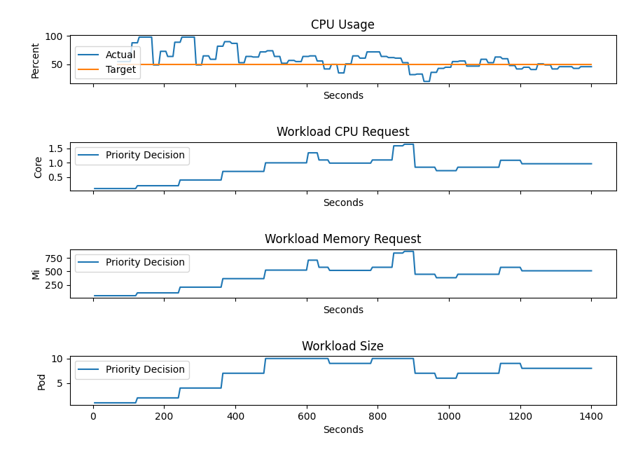
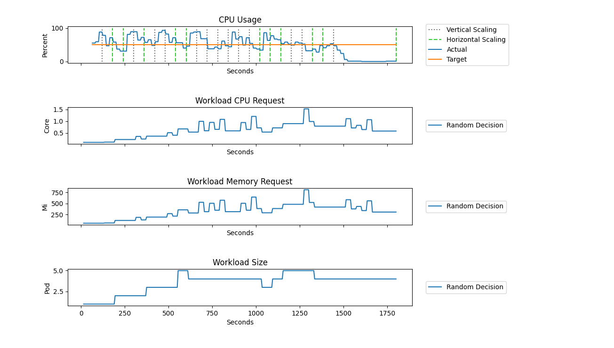
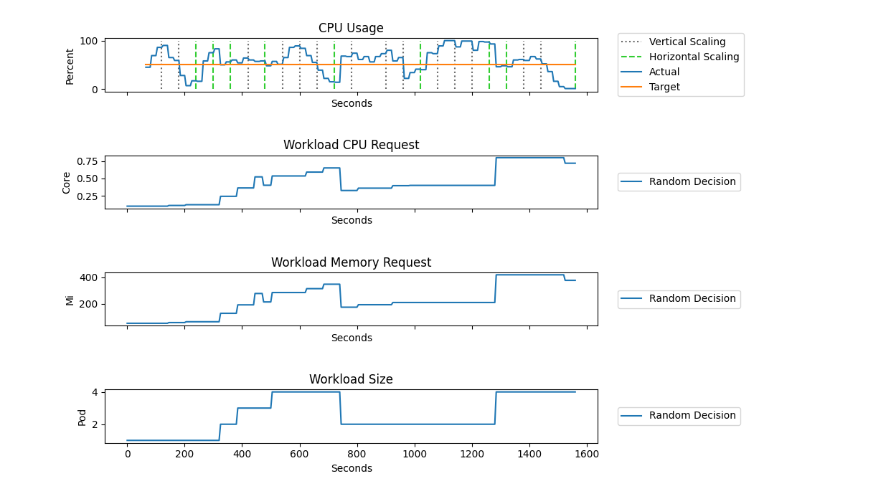

# Load Testing

This testing approach aims to show the effects of combinations of different elasticity strategies with custom decision logics.
We use Kubernetes' [Resource Consumer](https://pkg.go.dev/k8s.io/kubernetes/test/images/resource-consumer) to generate CPU load on the target workload.
The resource consumer is triggered by an HTTP request for a short duration to generate a predefined amount of CPU millis.
In order to distribute this load over multiple instances of the target deployment, we send the HTTP requests 10 times per second.

The resulting charts should show that an elasticity strategies are used to establish compliance with the SLO.
Individual test results can be then compared by the reader.
Even though reproducibility is an important factor for testing, this approach does not allow testcases to be fully reproduced due to various reasons like I/O errors.

## Environment

The tests presented in this document are executed using minikube with the following configuration:

    minikube start --kubernetes-version=v1.27.3 --feature-gates=InPlacePodVerticalScaling=true --container-runtime=containerd
    minikube addons enable metrics-server
    minikube addons enable ingress

## Priority Decision Logic

In this example the primary strategy is horizontal scaling, if the workload scale has reached limit the decision logic switches to the secondary strategy which is vertical scaling.
It is clearly visible on the results that the SLO controller scales to workload up if the current utilization exceeds the target.
Any scaling action is skipped if the current CPU usage hovers near the target CPU usage.

## Random Decision Logic

## Round Robin Decision Logic

## New Resize Policy

In version 1.27, Kubernetes has introduced its [new alpha feature](https://kubernetes.io/blog/2023/05/12/in-place-pod-resize-alpha/) called in-place pod resize. The new feature enables container resizing without needing any restarts in the pod.
This comes very handy in situations where an application might require more resources at certain stages of its life e.g. Java applications typically have higher CPU usage upon initialization.
Not only restarts are avoided, but pending containers due to scaling do not occur, therefore the resource requests of a deployment are not influenced by _pending_ scaling action.

Currently, the feature is available through enabling the feature gate `InPlacePodVerticalScaling` and by configuring the `resizePolicy` of the target workload:

    resizePolicy:
      - resourceName: cpu
      restartPolicy: NotRequired
      - resourceName: memory
      restartPolicy: RestartContainer

In the example above, if the CPU resource request is changed, the container is not restarted.
However, when resizing the memory of the container, it is restarted.

The following charts show that in-place resize has a significant impact on workload resource request as no jitters occur due to pending pods.
Having no jitters will benefit scaling in a sense that pods can be scheduled even if there is not enough resources to start a new container to replace to old one.
Thanks to this behavior other workloads are not blocked due to vertical scaling action is replacing pods.

