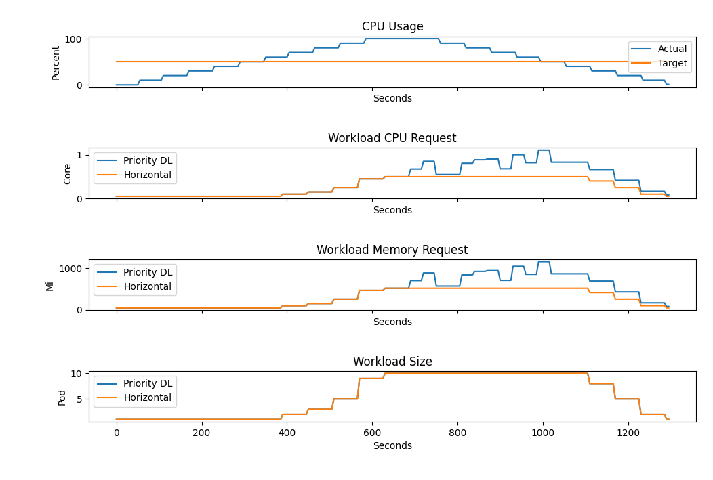

# Priority Decision Logic

## Introduction

The Priority Decision Logic is a simple yet great way of combining two arbitrary elasticity strategies. In this short example we combine HorizontalElasticityStrategy with VerticalElasticityStrategy.

The decision logic always chooses the primary elasticity strategy over the secondary if the primary one is available meaning potential scaling effect is achievable.
Tracking the behavior of this strategy is fairly straightforward, because as long as the primary elasticity strategy is within its boundaries it will always be chosen over the secondary.

## Motivation

Apache Kafka is a popular event streaming platform designed for real-time data streaming requirements. Kafka is meant to handle high-throughput applications, which require parallel processing capabilities. Thus, topics do not act as a queue, but consist of one or multiple partitions that act as an independent ordered log.
Partitions can be processed parallel by multiple instances. However, a single consumer group cannot have more instances than partitions of a topic meaning extra instances won't be assigned any log by Kafka and will idle until another instance terminates.
The number of partitions of a single topic should be chosen based on the actual use-case. Although the number partitions can be increased, this operation might involve some complexity based on the application.

Priority Decision Logic aims to be a great alternative to horizontal scaling and repartitioning through its multidimensional scaling capabilities.

Primarily, it can scale the consumer workload horizontally to match the target CPU utilization.
Secondarily, in contrast to simple horizontal scaling, it can further increase throughput of the active consumers even if maximum number of instances has been reached by leveraging vertical scaling. 

## Test Case

| Workload      | Min | Max |
|---------------|-----|-----|
| Pod CPU mi    | 50  | 200 |
| Pod Memory Mi | 50  | 100 |
| Scale         | 1   | 10  |

Given that throughput is correlated to CPU and memory resources, we can conclude that priority decision logic can achieve a substantial increase in throughput as the CPU and memory resources were higher by 50 %.
It is worth noting that resource request jitters occur on vertical scaling as Kubernetes scales up new pods that replace existing ones.

The statement about the simple behavior seems to be verified, as the scale of the workload is completely equal to the horizontally scaled workload all the time during the test.

