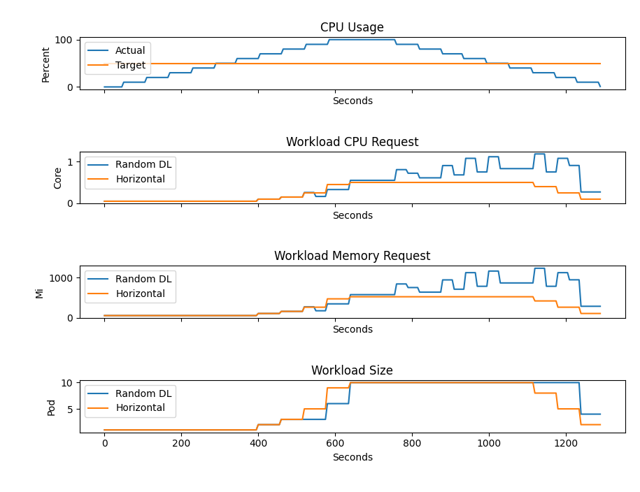

# Random Decision Logic

## Introduction

The Random Decision Logic is a naive implementation of Decision Logic. This strategy allows two elasticity strategies to be defined and chosen upon any scaling action.
Elasticity strategies are picked randomly on every evaluation. This, however, does not affect the scaling action itself as it depends on the SloCompliance.

## Motivation

Random Decision Logic acts as a baseline for testing and comparing elasticity strategies and used only for research purposes.

## Test Case

| Workload      | Min | Max |
|---------------|-----|-----|
| Pod CPU mi    | 50  | 200 |
| Pod Memory Mi | 50  | 100 |
| Scale         | 1   | 10  |

