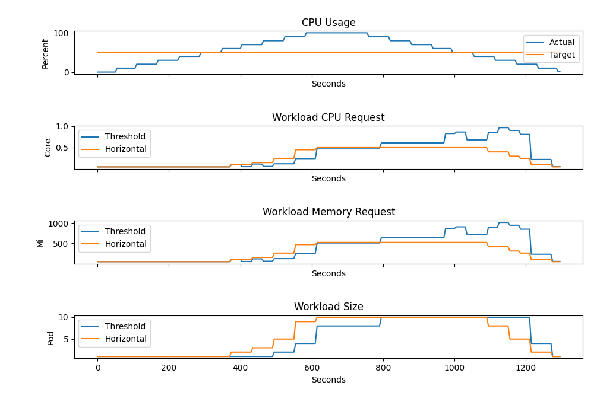

# Priority Decision Logic

## Introduction

The Threshold Decision Logic is a simple yet great way of combining two arbitrary elasticity strategies. In this short example we combine HorizontalElasticityStrategy with VerticalElasticityStrategy.

Fine-grained scaling is a key property, that is achieved by the definition of a threshold, which is used to decide between the two elasticity strategies.
On each evaluation of SLO compliance, the threshold value is compared against the deviation of the current SloCompliance and 100%.
Given the difference exceeds the threshold the primary elasticity strategy is executed, otherwise the secondary is picked to regain compliance with the SLO.

## Motivation

Whenever possible horizontal scaling is a great option to scale workloads to keep up with the requirements.
However, horizontal scaling may lead to over provisioning due to its characteristics, that the requested resources are multiplied by the number of instances.

Sudden load spikes can further outline the problem of over provisioning, as workloads cannot be adjusted in proportion to the load changes.
Over the long term a steady increase in resources is easily managed by ThresholdBasedDecisionLogic as vertical scaling allows fine-grained scaling over horizontal scaling.
When it comes to rapid scaling, this scaling strategy easily accomplishes it by utilizing horizontal scaling.

## Test Case

| Workload      | Min | Max |
|---------------|-----|-----|
| Pod CPU mi    | 50  | 200 |
| Pod Memory Mi | 50  | 100 |
| Scale         | 1   | 10  |

Based on the following chart group it is clearly visible that threshold based scaling is capable of a more fine-grained scaling than simple horizontal scaling.
Even though the threshold strategy introduced some lag in the scaling in the test case, the workload was scaled down rapidly as the CPU usage decreased.

